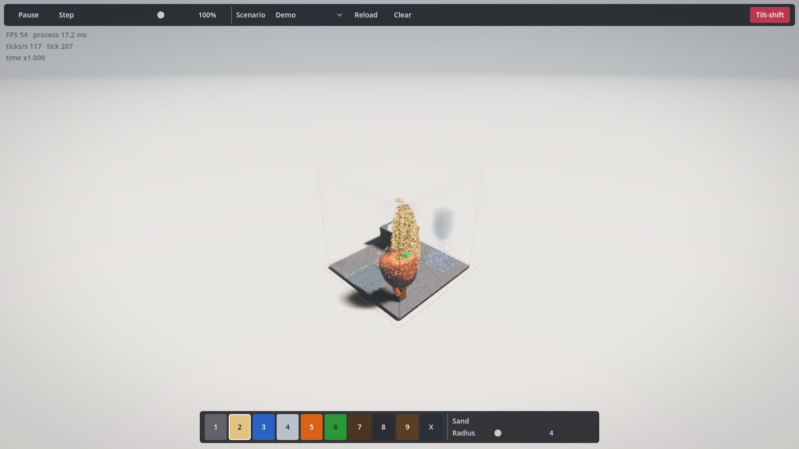
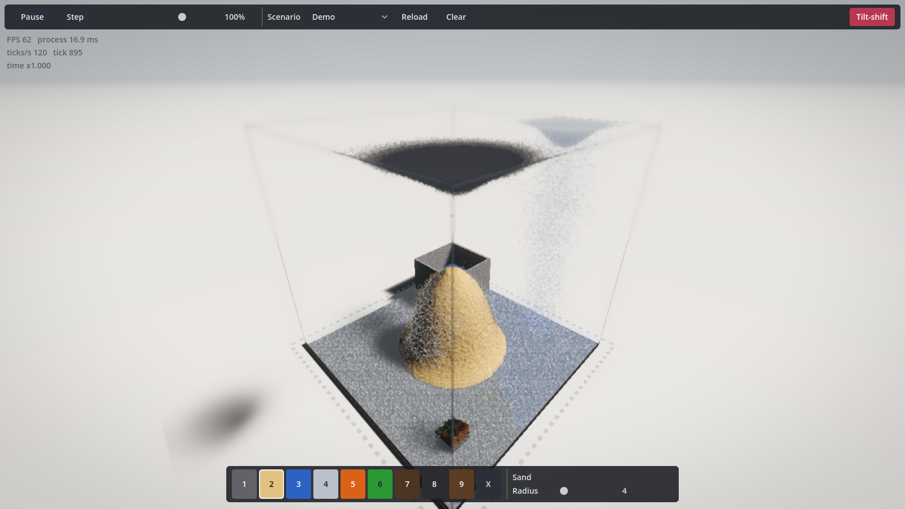
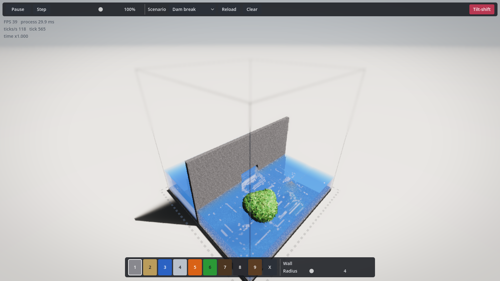
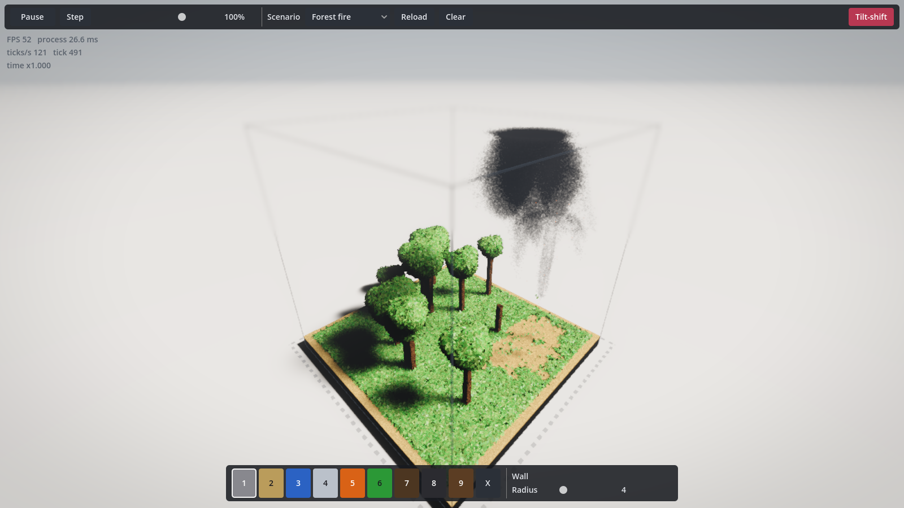
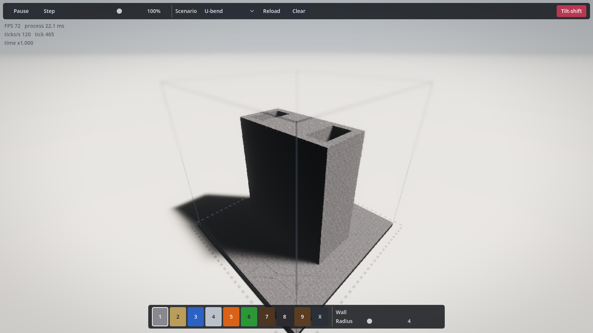

**Current implementation audit — 14 September 2026**

The project is a functioning GPU falling-sand prototype with a substantial rendering experiment around it. It does not yet establish a convincing foundation for the complete experience of a high-fidelity 3D Powder Toy. My assessment is that the GPU/cellular approach is worth retaining as a candidate, while the editing model, whole-world update strategy, and scope of the simulation need architectural evaluation before further feature expansion. The evidence does not establish a need to change engines or discard all the implementation.

This is an audit, not an implementation plan. No gameplay, shader, or scene changes were made for it. Temporary harnesses exercised the application through Godot APIs. The initial tree was commit `1de393a` plus soundscape/camera changes; those changes became commit `2b8262a` during the audit. A file comparison confirmed that the implementation at that commit matches the frozen audit snapshot. Orcaops project history was unavailable, so historical acceptance criteria and checkpoint lineage could not be verified. Git history, documentation, source, tests, and runtime captures were examined instead.

**What exists.** Godot 4.6.3, Forward+, Metal on the tested machine. A dense 256³ RGBA8 world represents 16,777,216 cells, each one centimetre across, in a 2.56 m box. The simulation uses disjoint 2×2×2 cellular blocks, line-based liquid redistribution, and a coarse air velocity/pressure solver. It has nine paintable elements and five reaction pairs. Rendering combines opaque and transparent raymarching, derived density and lighting volumes, and separate grain, leaf, droplet, and effect sprites. Eight presets include Empty. All shaders and the entire gameplay script surface were inspected.

The central state stays on the GPU and is sampled directly by the renderer. Element properties and reactions are table driven. These are useful foundations. The testing also verifies meaningful properties such as liquid mass conservation, settling, leveling, pressure communication, combustion, and plume movement.

**Runtime evidence.** Tests ran on an Apple M5 Pro with 20 GPU cores and 48 GB memory. Gameplay measurements use a visible 1600×900 window, 0.75 internal rendering scale, VSync disabled, default visual settings, and audio enabled. Each case has 45 warmup frames and 180 measured frames. The close camera is `(0.85, 0.65, 0.85)` in box widths. Painting submits one moving radius-4 sand stamp per frame, matching the brush's submission cadence; it is an API workload, not a hand-drawn stroke.

| Scenario / action | Average FPS | Average frame ms | 95th-percentile frame ms | Scheduled ticks/s |
|---|---:|---:|---:|---:|
| Demo, default view | 56.9 | 17.57 | 25.91 | 119.5 |
| Demo, close view | 59.4 | 16.84 | 22.06 | 120.1 |
| Demo, close view, painting | 40.5 | 24.67 | 28.76 | 115.1 |
| Demo, close view, paused | 211.7 | 4.72 | 5.59 | 0 |
| Demo, close view, paused and painting | 105.7 | 9.46 | 10.19 | 0 |
| Dam break, close view | 46.7 | 21.40 | 28.65 | 117.1 |
| Forest fire, close view | 54.2 | 18.44 | 26.43 | 117.8 |
| U-bend, close view | 53.3 | 18.75 | 39.09 | 108.7 |
| Oil spill, close view | 56.5 | 17.70 | 21.37 | 120.2 |

These are short wall-clock samples, not isolated per-pass GPU timings or broad hardware benchmarks. Scenes evolve between phases, so differences are indicative rather than perfectly controlled feature costs. The tick counter measures requested work, not independently verified GPU completion. The default and close-view phases also occur at different simulation times.

The initial obscured-window run stopped making rendering/readback progress while the main loop reported roughly 145 FPS. Those numbers were discarded. Keeping the test window always on top resolved the issue in the audit runs. The GPU suite initially stalled at an asynchronous occupancy readback; with the window visible it completed **74 checks with zero failures at grid 128**. The CPU suite completed **37 checks with zero failures**. The default-grid smoke test completed **3 checks with zero failures at grid 256**; it is a much narrower check than the grid-128 suite. Neither outcome verifies usability, visual quality, or broad hardware performance. No manual desktop input or listening assessment was performed.

[Measurement log](audit-evidence-2026-09-14/explore-visible.log), [GPU test log](audit-evidence-2026-09-14/gpu128-visible.log), [CPU test log](audit-evidence-2026-09-14/unit.log), and [audit harness](audit-evidence-2026-09-14/explore.gd). The harness retains its original temporary output directory; it is evidence of the procedure, not a newly installed project test.

**Findings and their implications.** CONFIRMED means directly established by source or reproduced behavior; REFUTED means a specific documented claim does not hold; UNVERIFIED identifies an unresolved hypothesis.

| # | Target | Verdict | Evidence and consequence |
|---|---|---|---|
| 1 | Precise 3D placement | CONFIRMED limitation | `scripts/sim/brush.gd:85` intersects only the box, then adds an adjustable ray depth. It never picks material surfaces or locks to a construction plane. The target changes with camera position and box-entry geometry. The user must infer depth from a translucent sphere. |
| 2 | Reliable strokes and non-destructive construction | CONFIRMED limitation | `brush.gd:74` paints one REPLACE sphere per rendered frame, without interpolation or a time-based emission rate. It can overwrite structures and leave gaps in fast strokes. ONLY_AIR exists in the simulation API but is not exposed by the brush. Minimum radius 1 also prevents a one-cell brush. |
| 3 | Depth precision | CONFIRMED limitation | Each Shift-scroll notch moves 0.03 box widths: 7.68 voxels at the default grid. This is coarse relative to the default radius-4 brush. There is no depth slider, world-axis guide, coordinate entry, or surface preview. |
| 4 | Time controls | REFUTED documented behavior | The README assigns `1` to both Wall and real time. Viewport event dispatch confirms it selects Wall and leaves the time state unchanged. After `0`, Space can set `paused=false` while `time_scale=0`, leaving the world frozen. The Play button calls the same pause toggle. |
| 5 | Construction and inspection toolset | CONFIRMED absence | No undo/redo, user-world save/load, selection/copy/paste, line/box tools, section planes, orthographic editing views, or element/field inspector exist in the gameplay code. Preset loading and test readback are not user persistence. Clear and Reload are immediate and unrecoverable through the UI. |
| 6 | Default visual readability | CONFIRMED capture; aesthetic judgment | The default scene occupies roughly one fifth of the window width. Pale background dominates; the box boundary is faint. Close views reveal highly noisy material surfaces, repeated leaf cards, and granular gas edges. MaterialLibrary explicitly describes its textures as procedural placeholders. More effects do not by themselves establish a coherent visual style. |
| 7 | Visibility of experiments | CONFIRMED capture and source | The U-bend's opaque casing hides its channel and water from the default viewing direction. There is no section view or inspection overlay. A simulated phenomenon can pass tests while remaining largely invisible to the player. |
| 8 | Local edit cost | CONFIRMED source and workload impact | `_rt_paint` calls `_rt_occupancy_update`, rebuilding occupancy, sprite buffers, full-resolution density fields/mips, and sun visibility. A tick batch also rebuilds these, so painting while running adds another rebuild. No dirty-region scheduling or settled-region sleep exists. |
| 9 | Scaling and world representation | CONFIRMED architectural constraint | The world and most derived fields are dense. The voxel texture alone is 64 MiB at 256³; doubling every dimension makes that 512 MiB, before other fields. Occupancy accelerates ray traversal and some sprite work, but it does not restrict simulation to active regions. Line-based hydro and air pressure also introduce nonlocal dependencies. |
| 10 | Simulation scope versus long-term ambition | CONFIRMED limitation | Nine paintable elements and five pair reactions support a small sandbox. There is no per-voxel temperature/conduction model, electrical state, rigid-body dynamics, or material momentum. Steam condensation and fire lifetime are probability-based; coarse heat drives air buoyancy. These are consequential model choices if physical fidelity or TPT-style machines are central. |
| 11 | Time consistency under load | CONFIRMED constraint | At grid 256, TimeController caps work at three ticks/frame and drops excess. Below 40 FPS it cannot sustain the requested 120 ticks/s. At 60 FPS, the cap permits at most 180 ticks/s, despite the UI allowing 400%. Air advances once per tick batch, so invariance to different frame/batch schedules is not established by current determinism tests. |
| 12 | Validation and documentation | CONFIRMED gaps | GPU tests exercise simulation state, not mouse targeting, UI dispatch, construction workflows, screenshot quality, or frame-time budgets. Most are explicitly authored for grid 128. `docs/voxel-format.md` still names removed density/shadow-proxy files and old formats. `docs/rules.md` describes a rule order and timing that differ from current code. |
| 13 | Engine choice as the root cause | UNVERIFIED | The audit identifies application-level design and workload problems. It does not compare equivalent implementations across engines. An engine rewrite is not supported by the measurements. |

A suspected stuck-paint condition when releasing over the toolbar did **not** reproduce in the viewport input test; it is not listed as a bug. Likewise, the early readback stall is not evidence that the simulation suite fails when its window remains visible.

**Visual evidence.** These images were captured by Godot from the application viewport; they contain no unrelated desktop content.

Default demo:

Close demo:

Dam break:

Forest fire:

U-bend, showing the inspection problem:

**Long-term assessment.** A GPU cellular simulation remains a credible candidate for a bounded desktop sandbox focused on many interacting substances. The current Margolus block rules can plausibly support more granular and chemical behavior. They do not automatically supply convincing fluid momentum, continuous motion, or moving machinery. If those are defining requirements, the simulation needs a deliberate extension or hybrid design; visual smoothing cannot supply missing physics.

A single dense volume is not inherently wrong for a deliberately small laboratory. It becomes restrictive if the intended game needs large or mostly empty worlds, detailed construction, or substantially more per-cell state. Chunking and active-region scheduling deserve evaluation, but are not a drop-in cure: pressure, heat, liquids, and reactions must remain correct across boundaries. The hydro solver currently walks complete lines, so changing storage alone would not remove its global work.

The rendering approach is also a candidate, not a settled architecture. Sharing GPU state directly, raymarching gases, and reconstructing surfaces can all be useful. But simulation resolution, world extent, editing precision, and visual detail are currently entangled. Attractive visual detail should not require increasing every physical field everywhere. Separate representation choices for static structures, granular surfaces, liquids, and gases may be appropriate, but this audit does not prove that a particular replacement renderer wins.

The strongest conceptual mismatch is the construction experience. [The Powder Toy's own project description and controls](https://github.com/The-Powder-Toy/The-Powder-Toy) center on drawing, experimenting, constructing machines, saving creations, and manipulating selections. This project currently centers on flying around a box and injecting spheres. Adding the third dimension introduces visibility and targeting problems that need first-class tools; a free camera does not resolve them.

Godot itself is not disqualified by these findings. Its [documented compute-shader support](https://docs.godotengine.org/en/stable/tutorials/shaders/compute_shaders.html) supports GPU workloads through RenderingDevice-based renderers. Platform targets still matter: this does not establish portability to every renderer/device, and the documentation specifically notes mobile driver limitations. A Windows/Linux or lower-end GPU assessment was not performed.

The direction is therefore only partly validated: there is reusable simulation and GPU infrastructure, but the present combination of fixed dense world, minimal editing, limited physical state, and effects-led presentation should not be treated as the final architecture. Before choosing a redesign, the unresolved product question is what “high fidelity” must mean: visual richness, physical behavior, construction precision, or a defined combination. The current prototype offers evidence about each, but has not yet demonstrated that combination as a playable experience.
