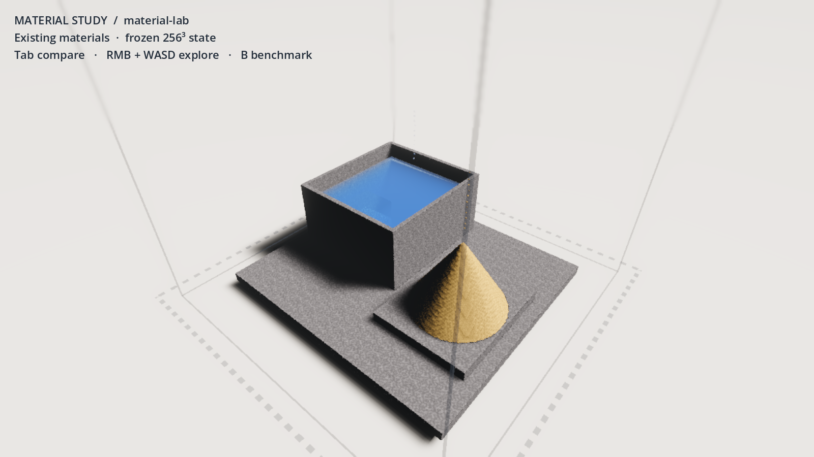
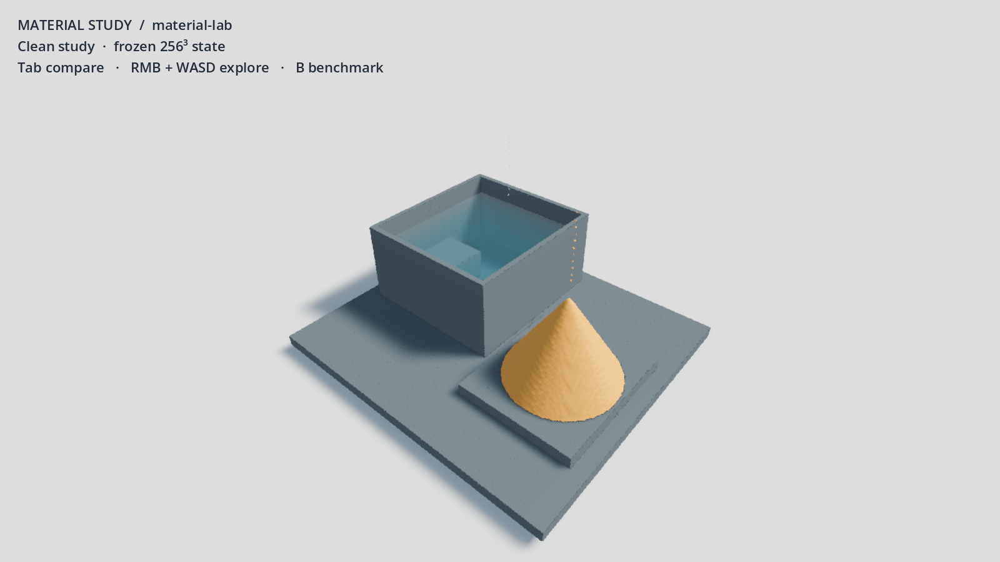
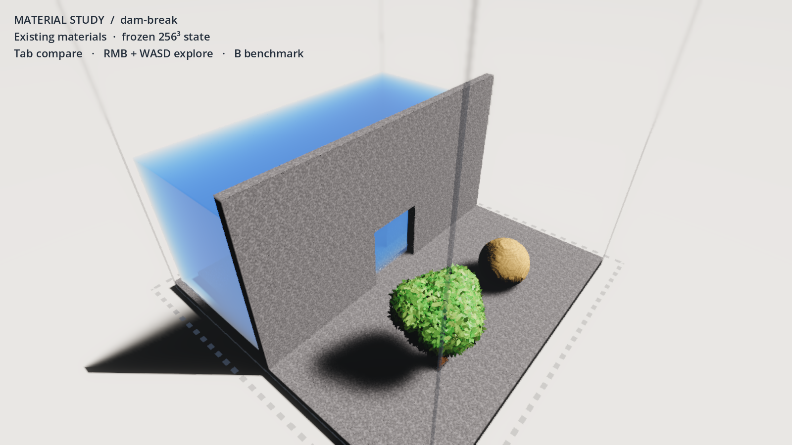
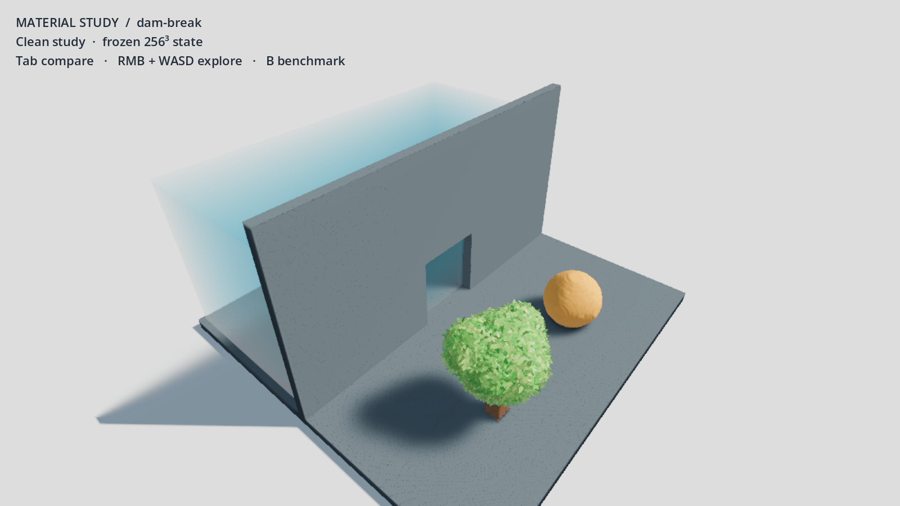

# Rendering discovery — fundamentals before more effects

This is an opt-in frozen rendering study, not an overhaul or a finished art direction. It tests whether the current GPU state / raymarch path can produce clearer, more coherent structures, sand and water by simplifying shading and presentation. It does not test better water motion, larger worlds, painting, or a replacement engine.

The user's long-term goal includes richer physics, construction, and visual fidelity; the latest steering makes WorldPainter the primary reference for casual paint-and-sim, with Amulet/MCEdit region tools and Besiege build/run separation as optional supporting ideas. Material coverage, brush footprints, and physical boundaries should read at both overview and close zoom; elaborate mandatory editor panels would work against that goal. No terrain sculpting implementation is included in this bounded study. The clean study treats the scene as a work surface. It removes high-contrast procedural normal/grain noise, lowers broad ambient illumination, uses slate structures/warm sand/teal water, and removes fog, glow, SSAO, motion blur, depth of field, and decorative world framing. The camera is close enough to inspect the experiment. This is a deliberately restrained starting point for material art, not a claim that untextured surfaces equal high fidelity. The study hides the decorative full-world cage to expose the specimen; an editor still needs purposeful grid, section, selection and axis guides. Removing those guides from an actual building workflow would be a regression.

## Runnable prototype and controlled comparison

```sh
godot --path . --always-on-top --disable-vsync -s res://tools/discovery/rendering.gd
# Tab: existing / clean materials; RMB + WASD: explore; B: run comparison; Esc: exit.
godot --path . --always-on-top --disable-vsync -s res://tools/discovery/rendering.gd -- batch=1
```

The standalone harness leaves the main scene defaults alone. One new `detail_strength` uniform in `voxel_opaque.gdshader` defaults to `1.0`, preserving the existing procedural material formula. Zero bypasses the decorative texture/normal/grain sampling. All other tuning is local to the harness.

The authored **material lab** has a low container of water, a submerged step, a sand cone on a tray, and separate synthetic airborne-grain/thin-spray cells. The cone and spray are explicitly authored geometry/state; they are not results of a successful simulation. **Dam break** is the existing initial preset, also frozen. Each scene is uploaded once before both repeat pairs. Both variants use the same perspective camera, world bytes, 1600×900 viewport, 0.75 render scale, and fixed simulation tick zero. SHA-256 checks of GPU readback verify that the world did not change during the comparison. UI, pause grading, audio and cosmetic FX are disabled in both variants. The baseline is therefore the current renderer under a controlled close framing, not the untouched launch experience.

Crucially, grain, droplet, and leaf layers stay visible in both variants. `fields.glsl` deliberately removes airborne powder and thin falling liquid from the surface field. Removing their sprites would erase visible physical content. These layers are representation, not optional garnish. Only the additional FX layer is omitted from both variants.

Each scene alternates baseline → clean twice, with 90 warmup frames and 240 measured frames per phase. Measurements are wall-clock presentation frame time with simulation paused; they include renderer and application overhead, not isolated GPU shader timestamps. Upload, field/occupancy/sun-visibility rebuild, readback, screenshot encoding, and shader warmup are outside sample windows. Keep the Godot window visible: occlusion can invalidate timings on this machine. This measures render cost only; the project's large running/painting costs remain a separate architecture issue.

## Evidence and validation

**Result:** the existing pipeline can make materially clearer images through presentation changes, but this study does not establish a performance improvement or a final high-fidelity look. The clean treatment is a readability diagnostic. The submerged step is visible through the lab water, material identity is clear, and structural edges compete with less high-frequency noise. Dark pinhole/speckle artifacts still remain across nominally flat walls and floor; the sand surface has grid-scale ripples; the leaf layer remains visually noisy. Those residuals require investigation of ray/surface reconstruction, compositing and sampling. Their exact cause has not been isolated. The large water reservoir in Dam break remains visibly cuboidal because this is its actual frozen initial state; no shader can add a missing simulated flow.

On this Apple M5 Pro / Metal 4.0 / Godot 4.6.3 run, the final perspective camera is `(0.68, 0.48, 0.80)` box widths, looking toward `(0, -0.28, 0)`, with a 55° field of view. This tighter framing is shared by both variants. An initial wider exploratory run was discarded when it proved too distant for useful material inspection; all committed screenshots and measurements come from the final run.

| Scene | Variant | Mean frame ms, repeat 1 / 2 | p95 frame ms, repeat 1 / 2 |
|---|---|---:|---:|
| Material lab | Existing | 7.35 / 7.06 | 20.37 / 18.26 |
| Material lab | Clean | 7.84 / 6.64 | 20.60 / 16.69 |
| Dam break | Existing | 6.80 / 7.81 | 19.05 / 20.82 |
| Dam break | Clean | 7.20 / 7.88 | 20.70 / 20.44 |

These short samples are noisy and overlap. Lower decorative shader work did **not** demonstrate lower total frame time. Do not extrapolate them to running/painting performance or claim that disabling effects is the main optimization. The two-scene sample also does not characterize gas-heavy scenes or extreme zooms.

[Raw measurements](rendering-evidence/measurements.json), [visible run log and state-hash checks](rendering-evidence/run.log), [headless import log](rendering-evidence/import.log), and [parser check](rendering-evidence/parse.log).

Material lab, existing:



Material lab, clean diagnostic:



Dam break, existing:



Dam break, clean diagnostic:



Validation completed: headless import; standalone GDScript parser; visible shader compilation; eight timed phases; four successful PNG saves; and two GPU readback SHA-256 equality checks. The final visible process exited 0. It printed an `ObjectDB instances leaked at exit` warning during teardown, with no runtime script/shader errors; resource-lifetime diagnosis is outside this study. Keyboard shortcuts are implemented in the runnable prototype but have not been manually usability-tested.

```sh
godot --headless --editor --path . --import --quit
godot --headless --path . --check-only -s res://tools/discovery/rendering.gd
godot --path . --always-on-top --disable-vsync -s res://tools/discovery/rendering.gd -- batch=1
git diff --check
```

## Architecture assessment

| Representation | What this study/source supports | Long-term issue / next discriminating experiment |
|---|---|---|
| GPU state shared with renderer | Retain as a useful interface: no full CPU copy per frame is necessary. | Publish versioned snapshots and dirty bounds so editing, derived fields, and rendering see the same state generation. |
| Opaque raymarch | Can reuse precise state and smooth powder heaps; the geometry is separable from the noisy decorative shading. | Compare cached/chunked meshes for settled structures at matched camera/geometry/resolution. This study does **not** benchmark a mesh alternative, so it does not establish a winner. |
| Liquid surface + absorption | A recognizable transparent liquid surface and submerged shapes can be drawn without changing state. | Current liquid surface lacks motion/momentum information to render convincing waves. Screen-space refraction cannot show hidden/off-screen objects and absorption is expressed per cell, tying perceived depth to grid scale. |
| Gas raymarch | Participating media belong in a volume representation; drawing solid cubes would lose the medium. | Current volume pass evaluates gas per traversed cell. Test smoother/lower-resolution density and temporal reconstruction; separate liquid and gas quality budgets without changing chemical state. |
| Grains / droplets | Required alternate representations for state excluded from density fields. | Explicit ownership rules must guarantee each physical cell is represented exactly once; visual LOD must not silently make material disappear. |
| Leaves / cosmetic particles | Can provide detail without increasing physical resolution everywhere. | Maintain separate identity: plant geometry can be authored/instanced; cosmetic particles must not become the source of truth for quantity, collision, editing, or saves. |

The current compute pipeline rebuilds fields, mips, sprite data and sun visibility together when state changes. Lowering shading cost does not fix that rebuild cost. Splitting rendering into representations only helps if derived-data invalidation becomes local and coordinated; it is not enough to put each pass in a separate file.

`Elements.TABLE` currently mixes physics properties with palette, texture layers, roughness and smoothing. Some smoothing also feeds the field-generation compute shader. A future material presentation table can be renderer-owned, but changes to surface reconstruction still need an explicit agreement about physical/editable boundaries. The state format must not depend on which decorative material is chosen.

## Proposed shared contract

- **Simulation snapshot:** stable material ID, cell/world transform, scalar quantities/flags, state generation, and dirty regions. Renderer references GPU resources without owning or mutating physical state.
- **Derived representations:** material-class occupancy, solid/liquid surface fields, gas density, and grain/droplet instances keyed to the same snapshot generation. Schedule updates once after a batch of edits/ticks, with region halos defined by each filter.
- **Physical picking:** editing targets authoritative cell/region data, with a snapshot generation and hit normal; screen shading/refraction never defines the edited cell. A stable construction plane remains available when no material is hit.
- **Inspection:** section/clip plane and selection bounds shared by every surface, volume and sprite pass; clipped material remains in simulation. Cutting only the opaque pass would leave invisible obstructions or misleading liquid/gas layers.
- **Presentation:** material appearance, lighting, visual detail scale, LOD, and quality budgets can change without expanding the physical grid. Grain/droplet representation has a required visibility fallback; decorative sparks/dust can be dropped independently.

This keeps the current engine and GPU simulation as candidates while making mesh, surface-raymarch and volumetric alternatives comparable. The next useful milestone is a readable construction/inspection workflow with direct painting and optional precise region controls with a measured render budget and correct representation at all tool zoom levels. No new shader effect can supply missing fluid physics or precise editing semantics.
