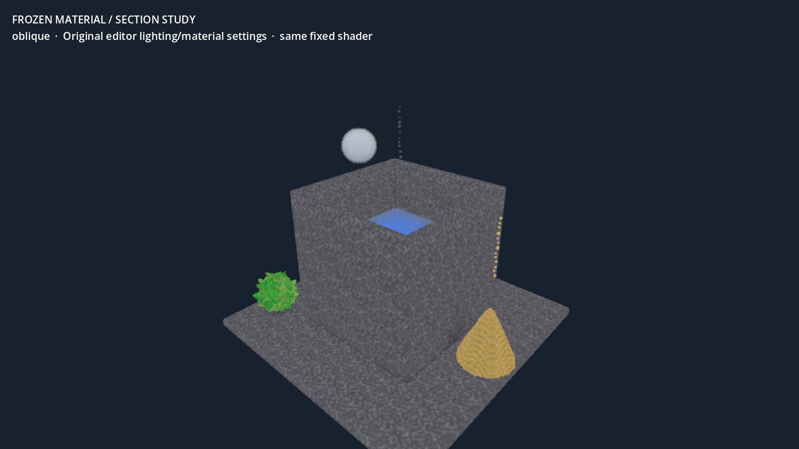
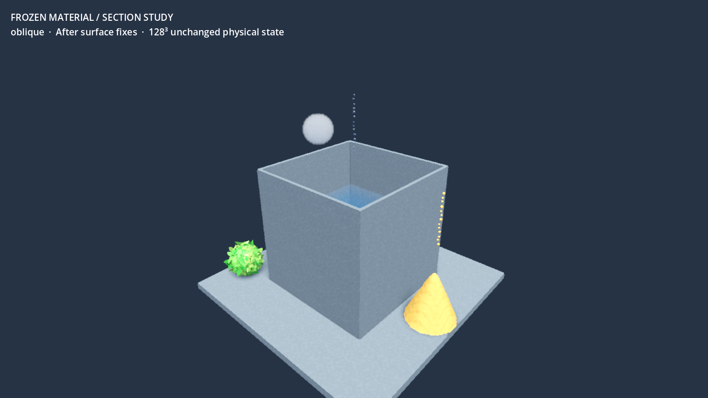
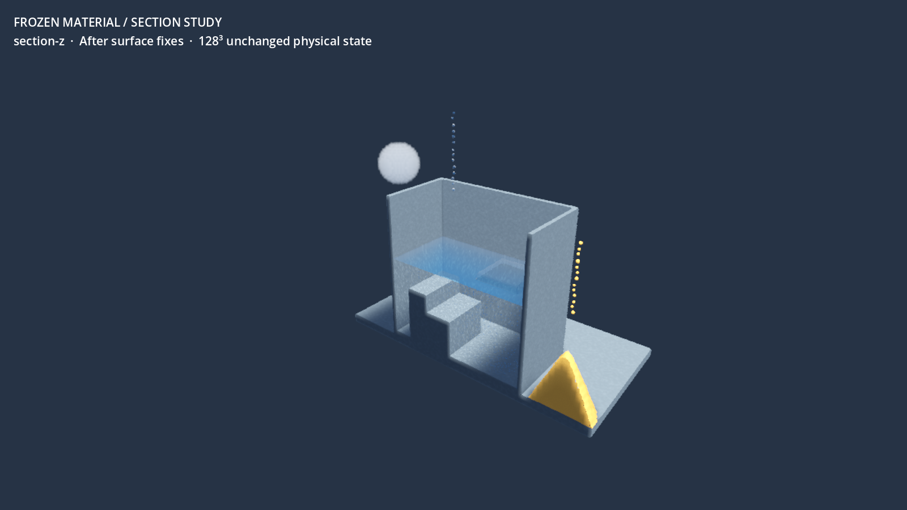

# Paint-first presentation module and matched captures

`editor_presentation.gd` gives the milestone editor a readable material/lighting baseline without changing simulation state, edit coordinates, camera gestures, section settings, or physical representation visibility. It is opt-in: main-scene defaults remain unchanged.

Integration call, after adding the editor's existing `WorldEnvironment`:

```gdscript
const Presentation := preload("res://scripts/render/editor_presentation.gd")
# sim, environment and this Node3D have entered the tree:
Presentation.apply(sim, environment, self)
```

The helper reuses/creates one `EditorSun`, aligned with the simulation's existing `sun_to` direction so the current sun-visibility field stays valid. It adds directional shape cues to the previously ambient-only editor, uses a dark neutral background, reduces decorative normal/grain strength to 0.18, keeps material identities distinct, and lowers water absorption/refraction so submerged construction is more visible. All grain, droplet and leaf layers stay enabled. The module does not rebuild fields, upload worlds, or control simulation time.

This is a functional material baseline for casual paint-and-sim, not final high-fidelity art. The specific palette/light energy can be refined independently. Bright foliage, grid-scale sand rippling, liquid cut-face noise and volumetric gas edges remain visible. The surface-normal and sprite-clipping defects have actual fixes and independent regression evidence in [the surface report](rendering-surfaces.md); tuning material settings is not offered as a substitute for those fixes.

## Comparisons and evidence

The capture harness authors a frozen container with water/oil and submerged steps, an external sand cone, a one-cell-wide wall panel, plant geometry, steam, and synthetic airborne-grain/thin-droplet flags. These are authored test fixtures, not claims of a successful dynamic pour. The camera is a close perspective view at 55°; the reverse view deliberately exposes the back and thin structure. There is no UI covering the specimen.

Ten 1600×900 captures at grid 128 and 0.75 rendering scale cover oblique/reverse and X/Z sections:

- `*-baseline.png` versus `*-fixed.png` use **identical new material/lighting settings**, camera and physical bytes. They isolate the surface-normal and sprite-section shader fixes.
- `*-original-editor-style.png` versus `*-fixed.png` use **the same fixed shaders** and physical bytes. They compare the previous editor's material/ambient-only lighting settings with the new opt-in presentation. They are not screenshots of the original editor UI.

These distinct comparisons prevent changed lighting from being mistaken for proof of a geometry fix. The baseline renderer fixtures preserve the old spatial-shader code. The actual liquid/gas pass is unchanged in every comparison.

After all ten captures, complete GPU voxel readback exactly matched the original upload:

`f99c9df0d8b9ccfc316c3befcd35495fca290e9aa45b002adc6999378e40a76e`

[Capture log](presentation-evidence/run.log). The visible process exited 0 with no shader/script errors. This is visual correctness/readability evidence, not a frame-time benchmark or a demonstration of runtime physics.

Previous editor material/lighting settings, using the fixed shader:



New presentation, same fixed shader/camera/world:



Section view exposes the submerged steps and interior without changing physical cells:



## Reproduction and remaining uncertainty

```sh
godot --headless --path . --check-only -s res://scripts/render/editor_presentation.gd
godot --headless --path . --check-only -s res://tools/milestone/capture_presentation.gd
godot --path . --always-on-top --disable-vsync -s res://tools/milestone/capture_presentation.gd -- grid=128
```

The shader-only section regression renders controlled billboard/card geometry independently of simulation. These full-state captures then verify the production representations coexist without mutating physical cells. They do not yet quantify every tiny sprite's visibility behind transparent surfaces. The volume shader's section-entry depth defect is now independently reproduced and corrected in the [liquid section depth report](liquid-section-depth.md). General transmission/compositing of embedded physical particles remains a separate limitation. The renderer also currently assumes perspective projection, so an orthographic editor view requires its own ray-origin implementation and validation.
