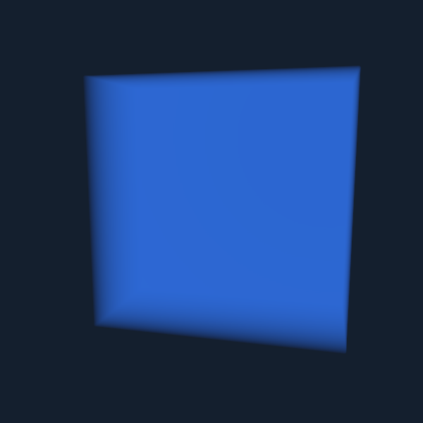

# Liquid edge speckles: a missed density exit

The volume renderer could keep integrating liquid after a ray had left it. Continuing exit detection while a liquid segment is open removes the bright blue edge speckles in the frozen box fixtures and corrects the integrated thickness of ordinary views and a one-cell water sheet. This is a shader correctness fix, with no physical-state, sprite-capacity, material-palette, or antialiasing change.

The one production change is in [`voxel_volume.gdshader`](../../shaders/spatial/voxel_volume.gdshader):

```glsl
// Before:
if (liquid || prev_liquid) {
// After:
if (in_liquid || liquid || prev_liquid) {
```

The old guard stopped checking the density after the first non-liquid cell. In observed rays, the sampled density fell below 0.5 later, but `in_liquid` remained true. The final integration then used the volume box exit instead of the material exit. The correction closes the segment when its sampled density actually crosses out. It applies outside sections too, where the same defect is independently reproduced.

The exact contribution of DDA floating-point error versus texture interpolation precision at the initial grazing boundary is not established. It is not necessary to assume one: shader instrumentation directly observes a retained liquid segment in air with density below 0.5, and an independent analytic ray/box test measures the resulting overlong path. No threshold bias, field smoothing change, or physical-cell edit is used to hide it.

## Evidence and tests

The initial native 600×600 image already contained speckles, so upscaling was not their sole cause. An entry-event diagnostic found **zero unexpected liquid entries** in 148,996 front-cap and 132,233 oblique-cap interior pixels, rejecting the initial false-Fresnel-entry hypothesis. A second diagnostic found **2,597 and 343 missed-exit pixels**, respectively. [`inspect_liquid_edges.gd`](../../tools/milestone/inspect_liquid_edges.gd) reproduces these diagnostics from the immutable pre-fix shader; [raw diagnostic counts](liquid-edge-evidence/diagnosis.json).

[`render_liquid_edges_gpu.gd`](../../tests/milestone/render_liquid_edges_gpu.gd) compares baseline/fixed integrated liquid length with CPU ray/box intersections at known frozen water boundaries. It tests all three section axes, front and oblique cameras, ordinary rendering, and a one-cell-thick sheet with sections off/on. Analytic probes sample every second pixel and exclude rounded box corners; they differ from the initial diagnostic's full-resolution cap-only sample region.

The length diagnostic encodes `liquid_len / grid_size` in an unshaded grayscale render. The test decodes sRGB8 before comparison. Its **0.75-cell tolerance** accounts for image quantization, four bisection steps, and the thin sheet's reconstructed boundary; it is not subpixel ground truth. Baseline errors are tens of cells, while the corrected maximum is 0.6251 cell. No acceptance tolerance was changed after seeing these results.

| Case | Analytic samples | Wrong baseline lengths (>0.75 cell) | Wrong fixed lengths | Maximum baseline → fixed error, cells |
|---|---:|---:|---:|---:|
| X cap, front | 34,287 | 626 | 0 | 56.228 → 0.372 |
| X cap, oblique | 30,463 | 78 | 0 | 51.963 → 0.404 |
| Y cap, front | 34,287 | 632 | 0 | 56.228 → 0.372 |
| Y cap, oblique | 30,451 | 79 | 0 | 49.123 → 0.404 |
| Z cap, front | 34,287 | 627 | 0 | 56.228 → 0.372 |
| Z cap, oblique | 30,462 | 86 | 0 | 50.676 → 0.403 |
| Ordinary, front | 73,719 | 684 | 0 | 56.604 → 0.600 |
| Ordinary, oblique | 59,212 | 301 | 0 | 98.336 → 0.625 |
| One-cell sheet, section | 1,807 | 29 | 0 | 65.080 → 0.397 |
| One-cell sheet, ordinary | 6,369 | 106 | 0 | 115.870 → 0.397 |
| **Total** | **335,344** | **3,248** | **0** | |

In each case the missed-exit marker count equals the wrong-length count in the baseline, and both are zero after the fix. Complete GPU voxel readback equals the uploaded bytes after every case. The regression passes **102 checks, zero failures**, on grid 128 / Metal / M5 Pro, at native resolution with screen-space AA disabled. [Metrics](liquid-edge-evidence/regression.json), [run log](liquid-edge-evidence/regression.log).

The separate [section-depth regression](liquid-section-depth.md) still passes **61 checks, zero failures**, including ordinary image identity between its depth variants. To keep that test isolating the original section-entry depth defect, both of its shader variants now share the independent exit-guard correction. Its original shader fixture and historical captures remain unchanged; this run uses a new output directory. [New depth metrics](liquid-edge-evidence/depth-regression/metrics.json), [new depth log](liquid-edge-evidence/depth-regression.log).

## Matched appearance

Native oblique section before:


Same state/camera/settings after:



[`capture_liquid_exit_stage.gd`](../../tools/milestone/capture_liquid_exit_stage.gd) reuses the authored water/oil/container/steps/sand/plant/steam specimen and changes only the volume shader. Six 1600×900 captures cover ordinary, X-section, and Z-section views at the existing 0.75 render scale plus FXAA. The earlier description called this MetalFX based on the base project setting; later runtime inspection found Godot's macOS override selects bilinear mode. This script does not override that setting. Grains, droplets, leaves, gas, and the opaque material pass remain enabled. Cosmetic live FX is disabled in this frozen fixture. The complete physical bytes remain identical, SHA-256:

```text
f99c9df0d8b9ccfc316c3befcd35495fca290e9aa45b002adc6999378e40a76e
```

[Stage run log](liquid-edge-evidence/stage.log). [Matched stage baseline](liquid-edge-evidence/stage-section-z-baseline.png) and [corrected stage](liquid-edge-evidence/stage-section-z-fixed.png). The simpler native cube makes the defect easiest to inspect; the material-stage difference is more subtle amid existing texture/detail noise.

## Scope, reproduction, and remaining limits

This unit does not compare AA presets, measure GPU performance, or recommend a universal rendering scale. The changed guard adds no texture allocation or new rendering pass; its timing impact is unmeasured. The editor retains its current preset. Motion/temporal aliasing, arbitrary liquid/gas mixtures, rounded corner coverage, order-dependent transmission of embedded particles, and other material-detail noise remain outside this proof. No claim is made that all liquid-edge artifacts or high-fidelity appearance are solved.

The first diagnostic after switching branches encountered stale imported compute SPIR-V with a push-constant mismatch. That run was discarded. Assets were reimported, and the diagnostic plus all accepted regressions ran without shader/script errors. This matters when reproducing from another worktree:

```sh
godot --headless --editor --path . --import
godot --headless --path . --check-only -s res://tests/milestone/render_liquid_edges_gpu.gd
godot --path . --always-on-top --disable-vsync -s res://tests/milestone/render_liquid_edges_gpu.gd -- grid=128
godot --path . --always-on-top --disable-vsync -s res://tools/milestone/capture_liquid_exit_stage.gd -- grid=128
godot --path . --always-on-top --disable-vsync -s res://tests/milestone/render_liquid_section_gpu.gd -- grid=128 out=res://docs/milestone/liquid-edge-evidence/depth-regression
```

Run visible GPU commands serially with an external timeout (60 seconds was sufficient for each accepted stage/depth run). The tests also bound asynchronous readback waits. Historical evidence folders are not overwritten by these commands. The pre-fix liquid shader is preserved separately as [`voxel_volume_edge_baseline.gdshader`](../../tests/milestone/fixtures/voxel_volume_edge_baseline.gdshader).
