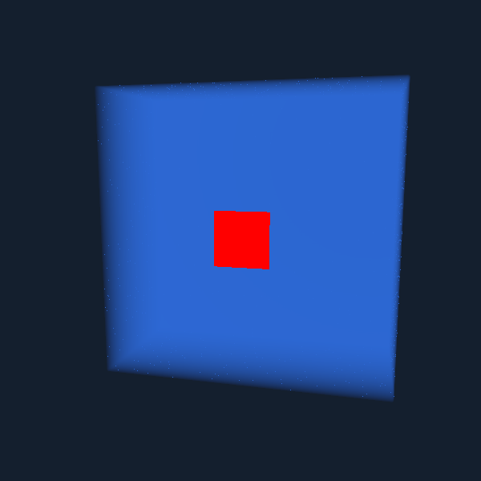
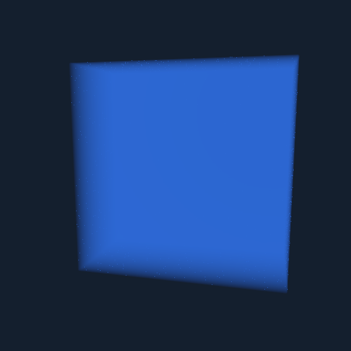

# Liquid section depth: confirmed and corrected

A section cut could render liquid color at its front face while writing depth near the back of the volume. Transparent geometry drawn afterward could therefore appear in front of that liquid even when it was behind the exposed cut.

The liquid shader initializes an already-inside-liquid segment when a ray enters a section. That path never crossed a density boundary and never initialized `t_first`. The final depth calculation then fell back to the volume exit. The correction records depth zero relative to ray entry when—and only when—the ray enters the positive section plane already inside liquid. It does not add a fictitious reflective air/water interface to the cut face.

The change is restricted by section enablement, a real external volume entry, the section axis, and the ray direction. Ordinary rendering, viewing the retained volume from its opposite side, and a camera already embedded in liquid retain their previous paths.

## Analytic depth test and matched captures

`render_liquid_section_gpu.gd` uploads a frozen cube of water and renders a red probe quad **after** the transparent voxel volume, with ordinary depth testing enabled. The probe is placed 0.01 box widths in front of or behind the known liquid boundary. Four camera configurations cover X, Y, Z and an oblique Z view; each runs with sections off/on and baseline/fixed shaders.

The test counts an 11×11 interior patch around the projected probe center. All 121 red pixels must remain visible for front probes; none may remain for behind probes. Front cases verify that disappearing probes are not merely unrendered or back-face culled. A preserved baseline volume shader reproduces the original defect.

| Situation | Baseline red samples | Fixed red samples |
|---|---:|---:|
| In front of section cap, every view | 121 / 121 | 121 / 121 |
| Behind section cap, every view | 121 / 121 | 0 / 121 |
| In front of ordinary liquid, every view | 121 / 121 | 121 / 121 |
| Behind ordinary liquid, every view | 0 / 121 | 0 / 121 |

All eight sections-off baseline/fixed image pairs are **pixel-identical**. Complete GPU readback after the 32 captures matches the original physical bytes exactly. The visible grid-128 run completed **61 checks, zero failures**, with no shader/script errors.

[Raw metrics](liquid-section-evidence/metrics.json), [run log](liquid-section-evidence/run.log), and [parser log](liquid-section-evidence/parser.log).

Oblique section, probe behind the cut—baseline:



Same state, camera and probe—fixed:



Probe in front of the same cut remains visible:


## Scope and remaining limits

This fixes consistency with the existing liquid-surface depth contract. It does not introduce order-independent transparency or physically exact transmission for particles embedded inside liquid. Required grain/droplet/leaf layers remain enabled; their normal depth occlusion still applies. Liquid edge speckling is visible in the matched captures and is not claimed fixed. Gas opacity/depth thresholds are unchanged.

The test validates grid 128, three section axes, one oblique view and the sampled front/behind separation. It is not a general performance measurement or a proof of all transparent-layer arrangements.

```sh
godot --headless --path . --check-only -s res://tests/milestone/render_liquid_section_gpu.gd
godot --path . --always-on-top --disable-vsync -s res://tests/milestone/render_liquid_section_gpu.gd -- grid=128
```
