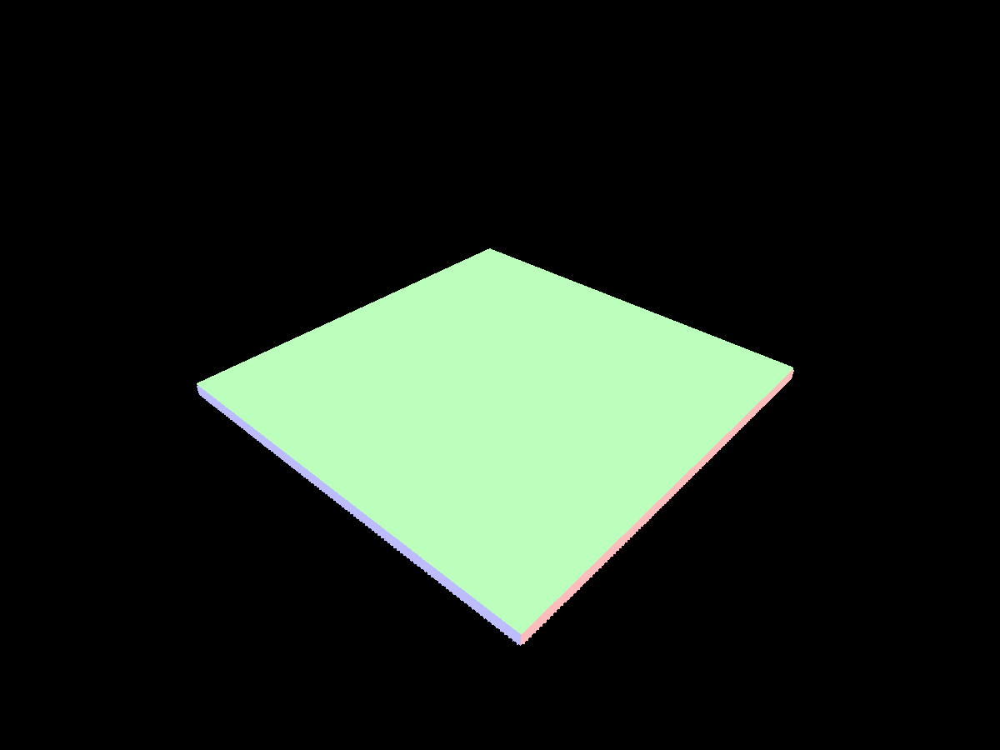
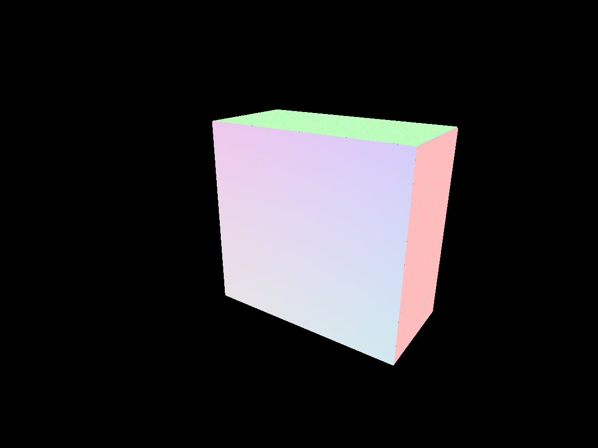
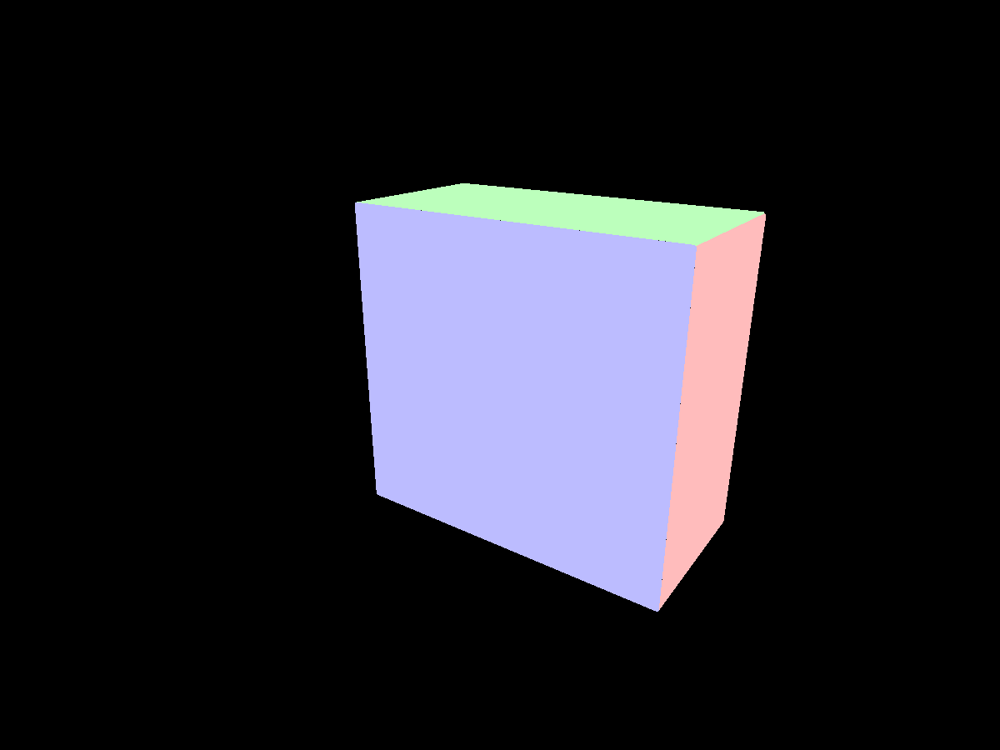
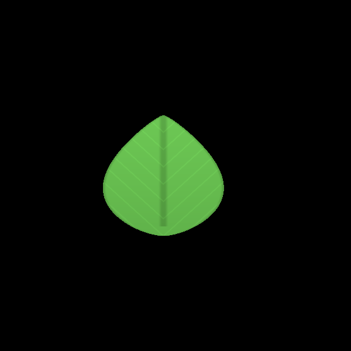
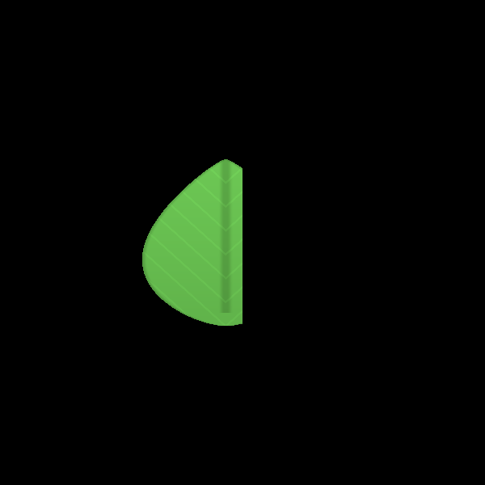

# Surface-normal defect: verified cause and first fix

The dark speckles on otherwise flat walls and floors were reproducible **incorrect normals**, not missing physical cells. The first milestone rendering change fixes this surface defect and the view-dependent normals on section caps. It does not change simulation bytes, density generation, ray intersection positions, material appearance, or the physical grain/droplet/leaf representation.

## Cause and correction

The opaque shader bisects a density crossing four times, then selected a rigid face normal by asking which coordinate of the approximate hit was nearest an integer cell plane. Bisection leaves a small error along the ray. An unrelated tangential cell boundary can consequently be nearer than the true surface plane. A floor pixel gets a side-facing normal, affecting directional lighting, AO and sun-visibility sampling. Raising texture quality or disabling decorative grain cannot fix this geometry-derived error.

The correction chooses the strongest axis of the already computed local density gradient, with its outward sign. A flat density boundary consistently identifies the actual surface axis, independently of bisection-position error. Smooth materials continue to use their reconstructed normals and existing blend weights.

Separately, an initial ray hit inside the clipped volume used `-ray.direction` as its normal. This made a flat section look curved as the camera moved. At volume entry, the correction uses the actual ray/box entry axis and direction; the cap stays axis-aligned. The visual clip still leaves all physical state intact.

## Controlled evidence

A preserved pre-fix shader and shared include are under `tests/milestone/fixtures/`; they are used only by the regression harness. Baseline and fixed shaders render the same frozen bytes through the same camera and viewport. The test displays geometric normals as RGB emission with no lighting, textures, AA, upscaler or volume transparency to confound the diagnosis. This isolates the defect instead of hiding it with softer lighting.

At grid 128, 1200×900 and native internal resolution, each analytic face is sampled at 9,216 projected interior world points. Sampling excludes six reference cells at each edge so silhouette interpolation or another visible face cannot masquerade as the tested flat face. Rendered RGB is converted back to linear normal coordinates and compared with the known axis normal. A maximum vector error of 0.08 accommodates 8-bit image quantization; a wrong axis is approximately 1.41 away. Coverage also checks for missing/black pixels. These are interior samples, not a proof of every silhouette pixel or every possible material mixture.

| Case | Baseline wrong normals | Fixed wrong normals | Missing samples, baseline/fixed |
|---|---:|---:|---:|
| Floor, oblique | 61 | 0 | 0 / 0 |
| Floor, reverse angle | 56 | 0 | 0 / 0 |
| Floor, grazing angle | 194 | 0 | 0 / 0 |
| One-cell-thick sheet | 72 | 0 | 0 / 0 |
| Section X | 9,216 | 0 | 0 / 0 |
| Section Y | 9,216 | 0 | 0 / 0 |
| Section Z | 9,216 | 0 | 0 / 0 |

Fixed maximum normal error is 0.00817 in every case, consistent with image quantization. All eight complete GPU voxel readbacks exactly matched their original upload after both variants. The expanded visible run completed **60 checks, zero failures**, with no script/shader errors. The metric is a surface correctness regression, not a performance benchmark.

[Raw metrics](rendering-evidence/surface-metrics.json), [visible GPU log](rendering-evidence/surface-run.log), and [parser log](rendering-evidence/parser.log).

Oblique floor, baseline versus fixed:




Section Z, baseline versus fixed:





The remaining ten normal captures are in the same evidence directory. Inspection of the full captures confirms the visible flat regions became uniform, rather than relying on an average pixel statistic alone.

## Reproduction and limits

```sh
godot --headless --editor --path . --import --quit
godot --headless --path . --check-only -s res://tests/milestone/render_surface_gpu.gd
godot --path . --always-on-top --disable-vsync -s res://tests/milestone/render_surface_gpu.gd -- grid=128
```

The visible process ran on Apple M5 Pro / Metal 4.0 / Godot 4.6.3. Keep its window visible during readbacks. This fix is independent of the simulation worker's foam timing and scheduling changes: no compute shader or simulator API changed.

An additional camera-inside fixture preserves the previous ray-facing fallback when the camera is embedded in physical material: there is no entry face in front of that camera. Its 3,996 visible samples match the expected varying ray normal in both versions (maximum error 0.01249). The fixed axis normal applies only to a real volume entry.

Remaining work: broad mixtures and silhouette/thin-feature coverage; liquid/gas section compositing; final art direction. Matched shaded captures and an opt-in presentation module are documented separately. The evidence does not establish elimination of every kind of visual noise, a final high-fidelity art direction, or an improvement in fluid physics.


## Section planes now clip sprite geometry

Grain, droplet, leaf and cosmetic FX shaders previously computed the cut coordinate once from the instance center and passed it as a flat varying. A card centered just inside the section remained fully visible across the supposedly removed half-space. Moving its center just outside removed the whole card, including geometry on the retained side.

All four shaders now interpolate the world-space coordinate of the actual vertex and clip each fragment. The coordinate is calculated **after** camera-facing billboard expansion; leaves transform their deformed vertex into world space. This uses the same world-aligned section plane as the volume boundary. No layer is disabled and no physical state is edited.

The shader-only test uses large controlled presentation instances against black, viewed square-on to a vertical cut. It deliberately has no simulation; this isolates clipping from sprite-emitter behavior. With each center 0.02 world units inside/outside the plane, it counts lit pixels on either side, excluding a two-pixel plane margin. Fixed cases have zero visible pixels on the clipped side and preserve thousands of pixels on the retained side. With the center inside, retained-side counts are identical before/after. With the center outside, baseline counts are zero while fixed retained geometry remains visible.

| Layer | Baseline pixels protruding, center inside | Fixed protruding | Retained pixels recovered, center outside |
|---|---:|---:|---:|
| Grain | 12,168 | 0 | 12,370 |
| Droplet | 12,168 | 0 | 12,370 |
| Leaf | 10,407 | 0 | 10,598 |
| FX | 10,518 | 0 | 10,708 |

The run completed **40 checks, zero failures**. This validates the common planar-clipping defect with a controlled view, not every rotated camera, deformed leaf phase, or physical sprite capacity. [Raw metrics](rendering-evidence/sprite-section-metrics.json), [run log](rendering-evidence/sprite-section-run.log), and all sixteen captures are retained.

Leaf card baseline and fixed, cut at image center:





```sh
godot --path . --always-on-top --disable-vsync -s res://tests/milestone/render_section_sprites_gpu.gd
```
